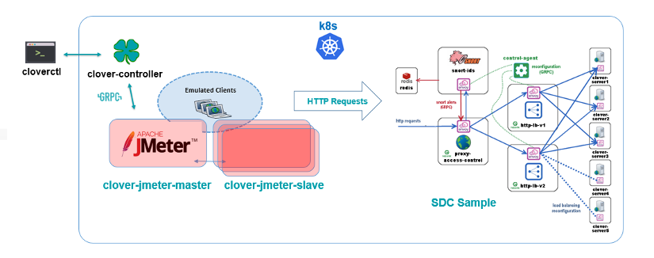

.. This work is licensed under a Creative Commons Attribution 4.0 International License.
.. http://creativecommons.org/licenses/by/4.0
.. SPDX-License-Identifier CC-BY-4.0
.. (c) Authors of Clover

.. _jmeter_config_guide:

=======================================
JMeter Validation Configuration Guide
=======================================

This document provides a guide to use the JMeter validation service, which is introduced in
the Clover Gambia release.

Overview
=========

`Apache JMeter`_ is a mature, open source application that supports web client emulation. Its
functionality has been integrated into the Clover project to allow various CI validations
and performance tests to be performed. The system under test can either be REST services/APIs
directly or a set of L7 network services. In the latter scenario, Clover nginx servers may
be employed as an endpoint to allow traffic to be sent end-to-end across a service chain.

The Clover JMeter integration is packaged as docker containers with manifests to deploy
in a Kubernetes (k8s) cluster. The Clover CLI (**cloverctl**) can be used to configure and
control the JMeter service within the k8s cluster via **clover-controller**.

The Clover JMeter integration has the following attributes:

 * **Master/Slave Architecture:** uses the native master/slave implementation of JMeter. The master
   and slaves have distinct OPNFV docker containers for rapid deployment and usage. Slaves allow
   the scale of the emulation to be increased linearly for performance testing. However, for
   functional validations and modest scale, the master may be employed without any slaves.

 * **Test Creation & Control:** JMeter makes use of a rich XML-based test plan. While this offers
   a plethora of configurable options, it can be daunting for a beginner user to edit directly.
   Clover provides an abstracted yaml syntax exposing a subset of the available configuration
   parameters. JMeter test plans are generated on the master and tests can be started from
   **cloverctl** CLI.

 * **Result Collection:** summary log results and detailed per-request results can be retrieved
   from the JMeter master during and after tests from the **cloverctl** or from a REST API exposed
   via **clover-controller**.

Deploying Clover JMeter service
===============================

Prerequisites
-------------

The following assumptions must be met before continuing on to deployment:

 * Installation of Docker has already been performed. It's preferable to install Docker CE.
 * Installation of k8s in a single-node or multi-node cluster.
 * Clover CLI (**cloverctl**) has been downloaded and setup. Instructions to deploy can be found
   at :ref:`controller_services_controller`
 * The **clover-controller** service is deployed in the k8s cluster the validation services will
   be deployed in. Instructions to deploy can be found at :ref:`controller_services_controller`.

Deploy with Clover CLI
-----------------------

The easiest way to deploy Clover JMeter validation services into your k8s cluster is to use the
**cloverctl** CLI using the following command:

.. code-block:: bash

    $ cloverctl create system validation

Container images with the Gambia release tag will pulled if the tag is unspecified. The release
tag is **opnfv-7.0.0** for the Gambia release. To deploy the latest containers from master, use
the command shown below::

    $ cloverctl create system validation -t latest

The Clover CLI will add master/slave pods to the k8s cluster in the default namespace.

The JMeter master/slave docker images will automatically be pulled from the OPNFV public
Dockerhub registry. Deployments and respective services will be created with three slave
replica pods added with the **clover-jmeter-slave** prefix. A single master pod will be
created with the **clover-jmeter-master** prefix.

Deploy from source
------------------

To continue to deploy from the source code, clone the Clover git repository and navigate
within to the directory, as shown below:

.. code-block:: bash

    $ git clone https://gerrit.opnfv.org/gerrit/clover
    $ cd clover/clover/tools/jmeter/yaml
    $ git checkout stable/gambia

To deploy the master use the following two commands, which will create a manifest with
the Gambia release tags and creates the deployment in the k8s cluster::

    $ python render_master.py --image_tag=opnfv-7.0.0 --image_path=opnfv
    $ kubectl create -f clover-jmeter-master.yaml

JMeter can be injected into an Istio service mesh. To deploy in the default
namespace within the service mesh, use the following command for manual
sidecar injection::

    $ istioctl kube-inject -f clover-jmeter-master.yaml | kubectl apply -f -

**Note, when injecting JMeter into the service mesh, only the master will function for
the Clover integration, as master-slave communication is known not to function with the Java
RMI API. Ensure 'istioctl' is in your path for the above command.**

To deploy slave replicas, render the manifest yaml and create in k8s adjusting the
``--replica_count`` value for the number of slave pods desired::

    $ python render_slave.py --image_tag=opnfv-7.0.0 --image_path=opnfv --replica_count=3
    $ kubectl create -f clover-jmeter-slave.yaml

Verifying the deployment
------------------------

To verify the validation services are deployed, ensure the following pods are present
with the command below:

.. code-block:: bash

    $ kubectl get pod --all-namespaces

The listing below must include the following pods assuming deployment in the default
namespace:

.. code-block:: bash

    NAMESPACE   NAME                                       READY      STATUS
    default     clover-jmeter-master-688677c96f-8nnnr       1/1       Running
    default     clover-jmeter-slave-7f9695d56-8xh67         1/1       Running
    default     clover-jmeter-slave-7f9695d56-fmpz5         1/1       Running
    default     clover-jmeter-slave-7f9695d56-kg76s         1/1       Running
    default     clover-jmeter-slave-7f9695d56-qfgqj         1/1       Running

Using JMeter Validation
=======================

Creating a test plan
--------------------

To employ a test plan that can be used against the :ref:`sdc_config_guide` sample, navigate to
cloverctl yaml directory and use the sample named 'jmeter_testplan.yaml', which is shown below.

.. code-block:: bash

    load_spec:
        num_threads: 5
        loops: 2
        ramp_time: 60
        duration: 80
    url_list:
        - name: url1
          url: http://proxy-access-control.default:9180
          method: GET
          user-agent: chrome
        - name: url2
          url: http://proxy-access-control.default:9180
          method: GET
          user-agent: safari

The composition of the yaml file breaks down as follows:
 * ``load_spec`` section of the yaml defines the load profile of the test.
 * `num_threads`` parameter defines the maximum number of clients/users the test will emulate.
 * ``ramp_time`` determines the rate at which threads/users will be setup.
 * ``loop`` parameter reruns the same test and can be set to 0 to loop forever.
 * ``duration`` parameter is used to limit the test run time and be used as a hard cutoff when
   using loop forever.
 * ``url_list`` section of the yaml defines a set of HTTP requests that each user will perform.
   It includes the request URL that is given a name (used as reference in detailed per-request
   results) and the HTTP method to use (ex. GET, POST). The ``user-agent`` parameter allows this
   HTTP header to be specified per request and can be used to emulate browsers and devices.

The ``url`` syntax is <domain or IP>:<port #>. The colon port number may be omitted if port 80
is intended.

The test plan yaml is an abstraction of the JMeter XML syntax (uses .jmx extension) and can be
pushed to the master using the **cloverctl** CLI with the following command:

.. code-block:: bash

    $ cloverctl create testplan –f jmeter_testplan.yaml

The test plan can now be executed and will automatically be distributed to available JMeter slaves.

Starting the test
-----------------

Once a test plan has been created on the JMeter master, a test can be started for the test plan
with the following command:

.. code-block:: bash

    $ cloverctl start testplan

The test will be executed from the **clover-jmeter-master** pod, whereby HTTP requests will
originate directly from the master. The number of aggregate threads/users and request rates
can be scaled by increasing the thread count or decreasing the ramp time respectively in the
test plan yaml. However, the scale of the test can also be controlled by adding slaves to the
test. When slaves are employed, the master will only be used to control slaves and will not be
a source of traffic. Each slave pod will execute the test plan in its entirety.

To execute tests using slaves, add the flag '-s' to the start command from the Clover CLI as shown
below:

.. code-block:: bash

    $ cloverctl start testplan –s <slave count>

The **clover-jmeter-slave** pods must be deployed in advance before executing the above command. If
the steps outlined in section `Deploy with Clover CLI`_ have been followed, three slaves will
have already been deployed.

Retrieving Results
------------------

Results for the test can be obtained by executing the following command:

.. code-block:: bash

    $ cloverctl get testresult
    $ cloverctl get testresult log

The bottom of the log will display a summary of the test results, as shown below::

    3  in 00:00:00 =  111.1/s Avg:     7 Min:     6 Max:     8 Err:     0 (0.00%)
    20 in 00:00:48 =    0.4/s Avg:    10 Min:     6 Max:    31 Err:     0 (0.00%)

Each row of the summary table is a snapshot in time with the final numbers in the last row.
In this example, 20 requests (5 users/threads x 2 URLs) x loops) were sent successfully
with no HTTP responses with invalid/error (4xx/5xx) status codes. Longer tests will produce
a larger number of snapshot rows. Minimum, maximum and average response times are output per
snapshot.

To obtain detailed, per-request results use the ``detail`` option, as shown below::

    $ cloverctl get testresult detail

    1541567388622,14,url1,200,OK,ThreadGroup 1-4,text,true,,843,0,1,1,14,0,0
    1541567388637,8,url2,200,OK,ThreadGroup 1-4,text,true,,843,0,1,1,8,0,0
    1541567388646,6,url1,200,OK,ThreadGroup 1-4,text,true,,843,0,1,1,6,0,0
    1541567388653,7,url2,200,OK,ThreadGroup 1-4,text,true,,843,0,1,1,7,0,0
    1541567400622,12,url1,200,OK,ThreadGroup 1-5,text,true,,843,0,1,1,12,0,0
    1541567400637,8,url2,200,OK,ThreadGroup 1-5,text,true,,843,0,1,1,8,0,0
    1541567400645,7,url1,200,OK,ThreadGroup 1-5,text,true,,843,0,1,1,7,0,0
    1541567400653,6,url2,200,OK,ThreadGroup 1-5,text,true,,843,0,1,1,6,0,0

Columns are broken down on the following fields:
 * timeStamp, elapsed, label, responseCode, responseMessage, threadName, dataType, success
 * failureMessage  bytes, sentBytes, grpThreads, allThreads, Latency, IdleTime, Connect

``elapsed`` or ``Latency`` values are in milliseconds.

Uninstall from Kubernetes environment
=====================================

Delete with Clover CLI
-----------------------

When you're finished working with JMeter validation services, you can uninstall it with the
following command:

.. code-block:: bash

     $ cloverctl delete system validation

The command above will remove the clover-jmeter-master and clover-jmeter-slave deployment
and service resources from the current k8s context.

Delete from source
------------------

The JMeter validation services can be uninstalled from the source code using the commands below:

.. code-block:: bash

    $ cd clover/samples/scenarios
    $ kubectl delete -f clover-jmeter-master.yaml
    $ kubectl delete -f clover-jmeter-slave.yaml

Uninstall from Docker environment
=================================

The OPNFV docker images can be removed with the following commands from nodes
in the k8s cluster.

.. code-block:: bash

    $ docker rmi opnfv/clover-jmeter-master
    $ docker rmi opnfv/clover-jmeter-slave
    $ docker rmi opnfv/clover-controller

.. _Apache JMeter: https://jmeter.apache.org/
