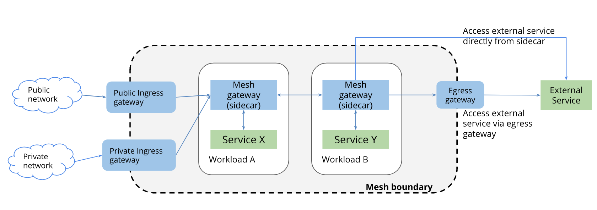

.. This work is licensed under a Creative Commons Attribution 4.0 International License.
.. http://creativecommons.org/licenses/by/4.0
.. SPDX-License-Identifier CC-BY-4.0
.. (c) Authors of Clover

.. _modsecurity_config_guide:

=========================================
ModSecurity Configuration Guide
=========================================

This document provides a guide to setup the ModSecurity web application firewall
as a security enhancement for the Istio ingressgateway.

ModSecurity Overview
=====================

ModSecurity is an open source web application firewall. Essentially, ModSecurity
is an Apache module that can be added to any compatible version of Apache. To
detect threats, the ModSecurity engine is usually deployed embedded within the
webserver or as a proxy server in front of a web application. This allows the
engine to scan incoming and outgoing HTTP communications to the endpoint.

In Clover, we deploy ModSecurity on an Apache server and running it as a
Kubernetes service that reside in "clover-gateway" namespace.

ModSecurity provides very little protection on its own. In order to become
useful, ModSecurity must be configured with rules. Dependent on the rule
configuration the engine will decide how communications should be handled which
includes the capability to pass, drop, redirect, return a given status code,
execute a user script, and more.

In Clover, we choose the OWASP ModSecurity Core Rule Set (CRS) for use with
ModSecurity.

The OWASP ModSecurity Core Rule Set (CRS) is a set of generic attack detection
rules. The CRS aims to protect web applications from a wide range of attacks,
including the OWASP Top Ten, with a minimum of false alerts.

Ingress traffic security enhancement
======================================

In a typical Istio service mesh, ingressgateway terminates TLS from external
networks and allows traffic into the mesh.

Clover enhances the security aspect of ingressgateway by redirecting all incoming
HTTP requests through the ModSecurity WAF. To redirect HTTP traffic to the ModSecurity,
Clover enables ext_authz (external authorization) Envoy filter on the ingressgateway.

For all incoming HTTP traffic, the ext_authz filter will authenticate each ingress
request with the ModSecurity service. To perform authentication, an HTTP subrequest
is sent from ingressgateway to ModSecurity where the subrequest is verified. If
the subrequest is clean, ModSecurity will return a 2xx response code, access is
allowed; If it returns 401 or 403, access is denied.

Deploying the ModSecurity WAF
==============================

.. _modsecurity_prerequisites:

Prerequisites
-------------

The following assumptions must be met before continuing on to deployment:

 * Installation of Kubernetes has already been performed.
 * Installation of Istio and Istio client (istioctl) is in your PATH.

Deploy from source
------------------

Clone the Clover git repository and navigate within the samples directory as
shown below:

.. code-block:: bash

    $ git clone https://gerrit.opnfv.org/gerrit/clover
    $ cd clover/samples/scenarios
    $ git checkout stable/gambia

To deploy the ModSecurity WAF in the "clover-gateway" Kubernetes namespace, use
the following command:

.. code-block:: bash

    $ kubectl create namespace clover-gateway
    $ kubectl apply -n clover-gateway -f modsecurity_all_in_one.yaml

Verifying the deployment
------------------------

To verify the ModSecurity pod is deployed, executing the command below:

.. code-block:: bash

    $ kubectl get pod -n clover-gateway

The listing below must include the following ModSecurity pod:

.. code-block:: bash

    $ NAME                                        READY     STATUS      RESTARTS   AGE
    modsecurity-crs-cf5fffcc-whwqm                1/1       Running     0          1d

To verify the ModSecurity service is created, executing the command below:

.. code-block:: bash

    $ kubectl get svc -n clover-gateway

The listing below must include the following ModSecurity service:

.. code-block:: bash

    $ NAME                     TYPE           CLUSTER-IP      EXTERNAL-IP   PORT(S)         AGE
    modsecurity-crs            NodePort       10.233.11.72    <none>        80:31346/TCP    1d

To verify the ext-authz Envoy filter is created, executing the command below:

.. code-block:: bash

    $ istioctl get envoyfilter -n clover-gateway

The listing below must include the following Envoy filter:

.. code-block:: bash

    $ NAME        KIND                                       NAMESPACE      AGE
    ext-authz   EnvoyFilter.networking.istio.io.v1alpha3     istio-system   1d

ModSecurity configuration
==========================

OWASP ModSecurity CRS mode
---------------------------

The OWASP ModSecurity CRS can run in two modes:

* **Anomaly Scoring Mode** - In this mode, each matching rule increases an
'anomaly score'. At the conclusion of the inbound rules, and again at the
conclusion of the outbound rules, the anomaly score is checked, and the blocking
evaluation rules apply a disruptive action, by default returning an error 403.

* **Self-Contained Mode** - In this mode, rules apply an action instantly. Rules
inherit the disruptive action that you specify (i.e. deny, drop, etc). The first
rule that matches will execute this action. In most cases this will cause evaluation
to stop after the first rule has matched, similar to how many IDSs function.

By default, the CRS runs in Anomally scoring mode.

You can configurate CRS mode by editing the **crs-setup.conf** in the modsecurity-crs
container:

.. code-block:: bash

    $ kubectl exec -t -i -n clover-gateway [modsecurity-crs-pod-name] -c modsecurity-crs -- bash
    $ vi /etc/apache2/modsecurity.d/owasp-crs/crs-setup.conf

Alert logging
-------------

By default, CRS enables all detailed logging to the ModSecurity audit log.
You can check the audit log using the command below:

.. code-block:: bash

    $ kubectl exec -t -i -n clover-gateway [modsecurity-crs-pod-name] -c modsecurity-crs -- cat /var/log/modsec_audit.log

CRS Rules
---------

By default, Clover enables all OWASP CRS rules. Below is a short description of all enabled rules:

* **REQUEST-905-COMMON-EXCEPTIONS**
Configuration Path: /etc/apache2/modsecurity.d/owasp-crs/rules/REQUEST-905-COMMON-EXCEPTIONS.conf

Some rules are quite prone to causing false positives in well established software,
such as Apache callbacks or Google Analytics tracking cookie. This file offers
rules that will allow the transactions to avoid triggering these false positives.

* **REQUEST-910-IP-REPUTATION**
Configuration Path: /etc/apache2/modsecurity.d/owasp-crs/rules/REQUEST-910-IP-REPUTATION.conf

These rules deal with detecting traffic from IPs that have previously been involved
with malicious activity, either on our local site or globally.

* **REQUEST-912-DOS-PROTECTION**
Configuration Path: /etc/apache2/modsecurity.d/owasp-crs/rules/REQUEST-912-DOS-PROTECTION.conf

The rules in this file will attempt to detect some level 7 DoS (Denial of Service)
attacks against your server.

* **REQUEST-913-SCANNER-DETECTION**
Configuration Path: /etc/apache2/modsecurity.d/owasp-crs/rules/REQUEST-913-SCANNER-DETECTION.conf

These rules are concentrated around detecting security tools and scanners.

* **REQUEST-920-PROTOCOL-ENFORCEMENT**
Configuration Path: /etc/apache2/modsecurity.d/owasp-crs/rules/REQUEST-920-PROTOCOL-ENFORCEMENT.conf

The rules in this file center around detecting requests that either violate HTTP
or represent a request that no modern browser would generate, for instance missing
a user-agent.

* **REQUEST-921-PROTOCOL-ATTACK**
Configuration Path: /etc/apache2/modsecurity.d/owasp-crs/rules/REQUEST-921-PROTOCOL-ATTACK.conf

The rules in this file focus on specific attacks against the HTTP protocol itself
such as HTTP Request Smuggling and Response Splitting.

* **REQUEST-930-APPLICATION-ATTACK-LFI**
Configuration Path: /etc/apache2/modsecurity.d/owasp-crs/rules/REQUEST-930-APPLICATION-ATTACK-LFI.conf

These rules attempt to detect when a user is trying to include a file that would
be local to the webserver that they should not have access to. Exploiting this type
of attack can lead to the web application or server being compromised.

* **REQUEST-931-APPLICATION-ATTACK-RFI**
Configuration Path: /etc/apache2/modsecurity.d/owasp-crs/rules/REQUEST-931-APPLICATION-ATTACK-RFI.conf

These rules attempt to detect when a user is trying to include a remote resource
into the web application that will be executed. Exploiting this type of attack can
lead to the web application or server being compromised.

* **REQUEST-941-APPLICATION-ATTACK-SQLI**
Configuration Path: /etc/apache2/modsecurity.d/owasp-crs/rules/REQUEST-941-APPLICATION-ATTACK-SQLI.conf

Within this configuration file we provide rules that protect against SQL injection
attacks. SQL attackers occur when an attacker passes crafted control characters
to parameters to an area of the application that is expecting only data. The
application will then pass the control characters to the database. This will end
up changing the meaning of the expected SQL query.

* **REQUEST-943-APPLICATION-ATTACK-SESSION-FIXATION**
Configuration Path: /etc/apache2/modsecurity.d/owasp-crs/rules/REQUEST-943-APPLICATION-ATTACK-SESSION-FIXATION.conf

These rules focus around providing protection against Session Fixation attacks.

* **REQUEST-949-BLOCKING-EVALUATION**
Configuration Path: /etc/apache2/modsecurity.d/owasp-crs/rules/REQUEST-949-BLOCKING-EVALUATION.conf

These rules provide the anomaly based blocking for a given request. If you are in
anomaly detection mode this file must not be deleted.

* **RESPONSE-954-DATA-LEAKAGES-IIS**
Configuration Path: /etc/apache2/modsecurity.d/owasp-crs/rules/RESPONSE-954-DATA-LEAKAGES-IIS.conf

These rules provide protection against data leakages that may occur because of Microsoft IIS

* **RESPONSE-952-DATA-LEAKAGES-JAVA**
Configuration Path: /etc/apache2/modsecurity.d/owasp-crs/rules/RESPONSE-952-DATA-LEAKAGES-JAVA.conf

These rules provide protection against data leakages that may occur because of Java

* **RESPONSE-953-DATA-LEAKAGES-PHP**
Configuration Path: /etc/apache2/modsecurity.d/owasp-crs/rules/RESPONSE-953-DATA-LEAKAGES-PHP.conf

These rules provide protection against data leakages that may occur because of PHP

* **RESPONSE-950-DATA-LEAKAGES**
Configuration Path: /etc/apache2/modsecurity.d/owasp-crs/rules/RESPONSE-950-DATA-LEAKAGES.conf

These rules provide protection against data leakages that may occur genericly

* **RESPONSE-951-DATA-LEAKAGES-SQL**
Configuration Path: /etc/apache2/modsecurity.d/owasp-crs/rules/RESPONSE-951-DATA-LEAKAGES-SQL.conf

These rules provide protection against data leakages that may occur from backend
SQL servers. Often these are indicative of SQL injection issues being present.

* **RESPONSE-959-BLOCKING-EVALUATION**
Configuration Path: /etc/apache2/modsecurity.d/owasp-crs/rules/RESPONSE-959-BLOCKING-EVALUATION.conf

These rules provide the anomaly based blocking for a given response. If you are
in anomaly detection mode this file must not be deleted.

* **RESPONSE-980-CORRELATION**
Configuration Path: /etc/apache2/modsecurity.d/owasp-crs/rules/RESPONSE-980-CORRELATION.conf

The rules in this configuration file facilitate the gathering of data about
successful and unsuccessful attacks on the server.
