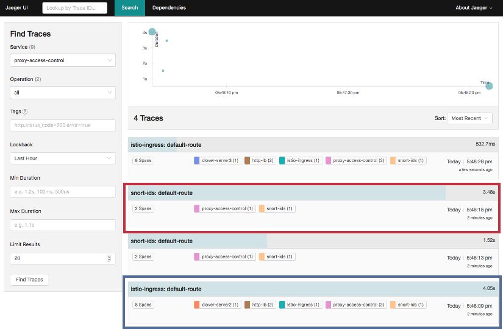

.. This work is licensed under a Creative Commons Attribution 4.0 International License.
.. http://creativecommons.org/licenses/by/4.0
.. SPDX-License-Identifier CC-BY-4.0
.. (c) Authors of Clover

.. _sdc_config_guide:

=======================================
Clover SDC Sample Configuration Guide
=======================================

This document provides a guide to use the Service Delivery Controller (SDC) sample, which is
initially delivered in the Clover Fraser release.

Overview
=========

The SDC is a sample set of web-oriented network services that allow the flow of ingress HTTP
traffic to be controlled and inspected in an Istio service mesh within Kubernetes. It provides
the ability to demonstrate the Istio sandbox including service mesh concepts and surrounding
tools including tracing, monitoring, and logging.

The SDC sample comprises the following services:

 * **Proxy** - used to mirror traffic to security (**snort-ids**) services and propagate traffic
   to load balancing services. In future releases, the proxy will process security alerts and
   provide access control by blacklisting clients based on source IP address.

 * **Load Balancer** - provides basic round-robin load balancing to other downstream
   services without Istio provisions. Istio features built-in load balancing to provide
   request routing for canary and A/B scenarios. The SDC sample employs both tiers
   of load balancing to demonstrate how load balancing algorithms can be controlled to
   address both network and application requirements.

 * **Intrusion Detection System** - used to detect web security vulnerabilities using limited
   set of rules/signatures and send security alerts to the proxy.

 * **Server** - simple web servers used to terminate web requests from the load balancing
   services to enable end-to-end traffic flow.

The table below shows key details of the sample Kubernetes manifest for the services
outlined above:

+---------------------+----------------------+------------------------+-----------------------+
| Service             | Kubernetes           | Docker Image           | Ports                 |
|                     | Deployment App Name  |                        |                       |
+=====================+======================+========================+=======================+
| Proxy               | proxy-access-control | clover-ns-nginx-proxy  | HTTP: 9180            |
|                     |                      |                        | GRPC: 50054           |
+---------------------+----------------------+------------------------+-----------------------+
| Load Balancers      | app: http-lb         | clover-ns-nginx-lb     | HTTP: 9180            |
|                     | version: http-lb-v1  |                        | GRPC: 50054           |
|                     | version: http-lb-v2  |                        |                       |
+---------------------+----------------------+------------------------+-----------------------+
| Intrusion Detection | snort-ids            | clover-ns-snort-ids    | HTTP: 80, Redis: 6379 |
| System (IDS)        |                      |                        | GRPC: 50052 (config)  |
|                     |                      |                        | GRPC: 50054 (alerts)  |
+---------------------+----------------------+------------------------+-----------------------+
| Servers             | clover-server1       | clover-ns-nginx-server | HTTP: 9180            |
|                     | clover-server2       |                        | GRPC: 50054           |
|                     | clover-server3       |                        |                       |
|                     | clover-server4       |                        |                       |
|                     | clover-server5       |                        |                       |
+---------------------+----------------------+------------------------+-----------------------+

Additionally, the sample uses other ancillary elements including:

 * A Redis in-memory data store for the snort IDS service to write alerts. It can also be used
   by the Clover tracing module to analyze traces over time. Standard community containers of
   Redis are employed by Clover.

 * A Kubernetes Ingress resource (**proxy-gateway**) to manage external access to the service
   mesh.

 * Clover docker container that is used to invoke deployment and cleanup scripts for the sample.
   It can also be used to execute scripts that modify run-time service configurations. Using the
   container avoids the need to clone the source code.

 * Optional deployment of Jaeger tracing and Prometheus monitoring tools with access to their
   browser-based UIs.

The diagram above shows the flow of web traffic where all blue arrows denote the path of incoming
HTTP requests through the service mesh. Requests are directed to the istio-ingress entry point
using the Ingress resource (**proxy-gateway**). Istio-ingress acts as a gateway and sends traffic
to the **proxy-access-control** service. **Proxy-access-control** mirrors traffic to the
**snort-ids** service for it to monitor all incoming HTTP requests. The **snort-ids**
asynchronously sends alert notifications to **proxy-access-control** over GRPC on port 50054,
which is denoted in red, and stores the details of the alert events into Redis for other services
to potentially inspect.

**Proxy-access-control** also sends traffic to the **http-lb** load balancing service. **Http-lb**
deploys two versions (**http-lb-v1**, **http-lb-v2**) of itself by sharing the same app name
(**http-lb**) but using a distinct version in the Kubernetes manifest. By default, without any
further configuration, Istio will load balance requests with a 50/50 percentage split among these
two **http-lb** versions. Both the load balancers are internally configured by default to send
traffic to **clover-server1/2/3** in round-robin fashion.

A controlling agent that can reside inside or outside of the mesh can be used to modify the
run-time configuration of the services, which is denoted in green. Python sample scripts that
implement a GRPC client act as a control-agent and are used to reconfigure **http-lb-v2** to load
balance across **clover-server4/5** instead of servers 1/2/3. The sample provides additional
examples of modifying run-time configurations such as adding user-defined rules to the
**snort-ids** service to trigger alerts on other network events.

Deploying the sample
====================

.. _sdc_prerequisites:

Prerequisites
-------------

The following assumptions must be met before continuing on to deployment:

 * Ubuntu 16.04 was used heavily for development and is advised for greenfield deployments.
 * Installation of Docker has already been performed. It's preferable to install Docker CE.
 * Installation of Kubernetes has already been performed. The installation in this guide was
   executed in a single-node Kubernetes cluster on a modest virtual machine.
 * Installation of a pod network that supports the Container Network Interface (CNI). It is
   recommended to use flannel, as most development work employed this network add-on. Success
   using Weave Net as the CNI plugin has also been reported.
 * Installation of Istio and Istio client (istioctl) is in your PATH (for deploy from source)

.. _sdc_deploy_container:

Deploy with Clover container
----------------------------

The easiest way to deploy the sample into your Kubernetes cluster is to use the Clover
container by pulling the container and executing a top-level deploy script using the following
two commands:

.. code-block:: bash

    $ docker pull opnfv/clover:<release_tag>

The <release_tag> is **opnfv-6.0.0** for the Fraser release. However, the latest
will be pulled if the tag is unspecified. To deploy the Fraser release use these commands:

.. code-block:: bash

    $ docker pull opnfv/clover:opnfv-6.0.0
    $ sudo docker run --rm \
    -v ~/.kube/config:/root/.kube/config \
    opnfv/clover \
    /bin/bash -c '/home/opnfv/repos/clover/samples/scenarios/deploy.sh'

The deploy script invoked above begins by installing Istio 0.6.0 into your Kubernetes environment.
It proceeds to deploy the entire SDC manifest. If you've chosen to employ this method of
deployment, you may skip the next section.

Deploy from source
------------------

Ensure Istio 0.6.0 is installed, as a prerequisite, using the following commands:

.. code-block:: bash

    $ curl -L https://github.com/istio/istio/releases/download/0.6.0/istio-0.6.0-linux.tar.gz | tar xz
    $ cd istio-0.6.0
    $ export PATH=$PWD/bin:$PATH
    $ kubectl apply -f install/kubernetes/istio.yaml

The above sequence of commands installs Istio with manual sidecar injection without mutual TLS
authentication between sidecars.

To continue to deploy from the source code, clone the Clover git repository and navigate
within the samples directory as shown below:

.. code-block:: bash

    $ git clone https://gerrit.opnfv.org/gerrit/clover
    $ cd clover/samples/scenarios
    $ git checkout stable/fraser

To deploy the sample in the default Kubernetes namespace, use the following command for Istio
manual sidecar injection:

.. code-block:: bash

    $ kubectl apply -f <(istioctl kube-inject --debug -f service_delivery_controller_opnfv.yaml)

To deploy in another namespace, use the '-n' option. An example namespace of 'sdc' is shown below:

.. code-block:: bash

    $ kubectl create namespace sdc
    $ kubectl apply -n sdc -f <(istioctl kube-inject --debug -f service_delivery_controller_opnfv.yaml)

When using the above SDC manifest, all required docker images will automatically be pulled
from the OPNFV public Dockerhub registry. An example of using a Docker local registry is also
provided in the ``/clover/samples/scenario`` directory.

Verifying the deployment
------------------------

To verify the entire SDC sample is deployed, ensure the following pods have been deployed
with the command below:

.. code-block:: bash

    $ kubectl get pod --all-namespaces

The listing below must include the following SDC pods assuming deployment in the default
Kubernetes namespace:

.. code-block:: bash

    $ NAMESPACE      NAME                                    READY     STATUS
    default        clover-server1-68c4755d9c-7s5q8           2/2       Running
    default        clover-server2-57d8b786-rf5x7             2/2       Running
    default        clover-server3-556d5f79cf-hk6rv           2/2       Running
    default        clover-server4-6d9469b884-8srbk           2/2       Running
    default        clover-server5-5d64f74bf-l7wqc            2/2       Running
    default        http-lb-v1-59946c5744-w658d               2/2       Running
    default        http-lb-v2-5df78b6849-splp9               2/2       Running
    default        proxy-access-control-6b564b95d9-jg5wm     2/2       Running
    default        redis                                     2/2       Running
    default        snort-ids-5cc97fc6f-zhh5l                 2/2       Running

The result of the Istio deployment must include the following pods:

.. code-block:: bash

    $ NAMESPACE    NAME                               READY     STATUS
    istio-system   istio-ca-59f6dcb7d9-9frgt          1/1       Running
    istio-system   istio-ingress-779649ff5b-mcpgr     1/1       Running
    istio-system   istio-mixer-7f4fd7dff-mjpr8        3/3       Running
    istio-system   istio-pilot-5f5f76ddc8-cglxs       2/2       Running

.. _sdc_ingress_port:

Determining the ingress IP and port
-----------------------------------

To determine how incoming http traffic on port 80 will be translated, use the following command:

.. code-block:: bash

    $ kubectl get svc -n istio-system
    NAME                TYPE           CLUSTER-IP       EXTERNAL-IP   PORT(S)
    istio-ingress       LoadBalancer   10.104.208.165   <pending>     80:32410/TCP,443:31045/TCP

**Note, the CLUSTER-IP of the service will be unused in this example since load balancing service
types are unsupported in this configuration. It is normal for the EXTERNAL-IP to show status
<pending> indefinitely**

In this example, traffic arriving on port 32410 will flow to istio-ingress. The
istio-ingress service will route traffic to the **proxy-access-control** service based on a
configured ingress rule, which defines a gateway for external traffic to enter
the Istio service mesh. This makes the traffic management and policy features of Istio available
for edge services.

Using the sample
================

To confirm the scenario is running properly, HTTP GET requests can be made from an external
host with a destination of the Kubernetes cluster. Requests can be invoked from the host OS
of the Kubernetes cluster. Modify the port used below (32410) with the port obtained from section
`Determining the ingress IP and port`_. If flannel is being used, requests can use the default
flannel CNI IP address, as shown below:

.. code-block:: bash

    $ wget http://10.244.0.1:32410/
    $ curl http://10.244.0.1:32410/

An HTTP response will be returned as a result of the wget or curl command, if the SDC sample
is operating correctly. However, the visibility into what services were accessed within
the service mesh remains hidden. The next section `Exposing tracing and monitoring`_ shows how
to inspect the internals of the Istio service mesh.

.. _sdc_view_container:

Exposing tracing and monitoring
-------------------------------

To gain insight into the service mesh, the Jaeger tracing and Prometheus monitoring tools
can also be deployed. These tools can show how the sample functions in the service mesh.
Using the Clover container, issue the following command to deploy these tools
into your Kubernetes environment:

.. code-block:: bash

    $ sudo docker run --rm \
    -v ~/.kube/config:/root/.kube/config \
    opnfv/clover \
    /bin/bash -c '/home/opnfv/repos/clover/samples/scenarios/view.sh'

The Jaeger tracing UI is exposed outside of the Kubernetes cluster via any node IP in the cluster
using the following commands **(above command already executes the two commands below)**:

.. code-block:: bash

    $ kubectl expose -n istio-system deployment jaeger-deployment --port=16686 --type=NodePort

Likewise, the Promethues monitoring UI is exposed with the following command:

.. code-block:: bash

    $ kubectl expose -n istio-system deployment prometheus --port=9090 --type=NodePort

To find the ports the Jaeger tracing and Prometheus monitoring UIs are exposed on, use the
following command:

.. code-block:: bash

    $ kubectl get svc --all-namespaces
    NAMESPACE      NAME              TYPE      CLUSTER-IP   EXTERNAL-IP   PORT(S)
    istio-system   jaeger-deployment NodePort  10.105.94.85 <none>        16686:32174/TCP
    istio-system   prometheus        NodePort  10.97.74.230 <none>        9090:32708/TCP

In the example above, the Jaeger tracing web-based UI will be available on port 32171 and
the Prometheus monitoring UI on port 32708. In your browser, navigate to the following
URLs for Jaeger and Prometheus respectively::

    http://<node IP>:32174
    http://<node IP>:32708

Where node IP is an IP from one of the Kubernetes cluster node(s).

The diagram above shows the Jaeger tracing UI after traces have been fetched for the
**proxy-access-control** service. After executing an HTTP request using the simple curl/wget
commands outlined in `Using the sample`_ , a list of SDC services will be displayed
in the top left drop-down box labelled ``Service``. Choose ``proxy-access-control`` in
the drop-down and click the ``Find Traces`` button at the bottom of the left controls.
The blue box denotes what should be displayed for the services that were involved in
handling the request including:

 * istio-ingress
 * proxy-access-control
 * http-lb
 * clover-server1 OR clover-server2 OR clover-server3

The individual traces can be clicked on to see the details of the messages between services.

Modifying the run-time configuration of services
================================================

The following control-plane actions can be invoked via GRPC messaging from a controlling agent.
For this example, it is conducted from the host OS of a Kubernetes cluster node.

**Note, the subsequent instructions assume the flannel network CNI plugin is installed. Other
Kubernetes networking plugins may work but have not been validated.**

.. _sdc_modify_lb:

Modifying the http-lb server list
----------------------------------

By default, both versions of the load balancers send incoming HTTP requests to
**clover-server1/2/3** in round-robin fashion. To have the version 2 load balancer
(**http-lb-v2**) send its traffic to **clover-server4/5** instead, issue the following command:

.. code-block:: bash

    $ sudo docker run --rm \
    -v ~/.kube/config:/root/.kube/config \
    opnfv/clover \
    /bin/bash -c 'python /home/opnfv/repos/clover/samples/services/nginx/docker/grpc/nginx_client.py \
    --service_type=lbv2 --service_name=http-lb-v2'

If the command executes successfully, the return message should appear as below::

    Pod IP: 10.244.0.184
    Modified nginx config
    Modification complete

If several more HTTP GET requests are subsequently sent to the ingress, the Jaeger UI should
begin to display requests flowing to **clover-server4/5** from **http-lb-v2**. The **http-lb-v1**
version of the load balancer will still balance requests to **clover-server1/2/3**.

Adding rules to snort-ids
--------------------------

The snort service installs the readily available community rules. An initial, basic provision to
allow custom rule additions has been implemented within this release. A custom rule will trigger
alerts and can be defined in order to inspect network traffic. This capability, including
rule manipulation, will be further expounded upon in subsequent releases. For the time being, the
following basic rule additions can be performed using a client sample script.

A snort IDS alert can be triggered by adding the HTTP User-Agent string shown below. The
signature that invokes this alert is part of the community rules that are installed in the
snort service by default. Using the curl or wget commands below, an alert can be observed using
the Jaeger tracing browser UI. It will be displayed as a GRPC message on port 50054 from the
**snort-ids** service to the **proxy-access-control** service. The red box depicted in the
Jaeger UI diagram in section `Exposing tracing and monitoring`_ shows what should be displayed
for the alerts. Drilling down into the trace will show a GPRC message from snort with HTTP URL
``http://proxy-access-control:50054/nginx.Controller/ProcessAlerts``.

.. code-block:: bash

    $ wget -U 'asafaweb.com' http://10.244.0.1:32410/

Or alternatively with curl, issue this command to trigger the alert:

.. code-block:: bash

    $ curl -A 'asafaweb.com' http://10.244.0.1:32410/

The community rule can be copied to local rules in order to ensure an alert is generated
each time the HTTP GET request is observed by snort using the following command.

.. code-block:: bash

    $ sudo docker run --rm \
    -v ~/.kube/config:/root/.kube/config \
    opnfv/clover \
    /bin/bash -c 'python /home/opnfv/repos/clover/samples/services/snort_ids/docker/grpc/snort_client.py \
    --cmd=addscan --service_name=snort-ids'

Successful completion of the above command will yield output similar to the following::

    Pod IP: 10.244.0.183
    Stopped Snort on pid: 34, Cleared Snort logs
    Started Snort on pid: 91
    Added to local rules

To add an ICMP rule to snort service, use the following command:

.. code-block:: bash

    $ sudo docker run --rm \
    -v ~/.kube/config:/root/.kube/config \
    opnfv/clover \
    /bin/bash -c 'python /home/opnfv/repos/clover/samples/services/snort_ids/docker/grpc/snort_client.py \
    --cmd=addicmp --service_name=snort-ids'

Successful execution of the above command will trigger alerts whenever ICMP packets are observed
by the snort service. An alert can be generated by pinging the snort service using the flannel IP
address assigned to the **snort-ids** pod. The Jaeger UI can again be inspected and should display
the same ``ProcessAlert`` messages flowing from the **snort-ids** to the **proxy-access-control**
service for ICMP packets.

Advanced Usage
===============

Inspect Redis
-------------

This section assumes alert messages have already been successfully generated from the
**snort-ids** service using the instructions outlined in section `Adding rules to snort-ids`_.

The **snort-ids** service writes the details of alert events into a Redis data store deployed
within the Kubernetes cluser.  This event and packet data can be inspected by first
installing the ``redis-tools`` Linux package on one of the nodes within the Kubernetes cluster.
For a Ubuntu host OS, this can be performed with the following command:

.. code-block:: bash

    $ sudo apt-get install redis-tools

Assuming a flannel CNI plugin, Redis can then be accessed by finding the IP assigned to the
Redis pod with the command:

.. code-block:: bash

    $ kubectl get pod --all-namespaces -o wide
    NAMESPACE      NAME        READY     STATUS    RESTARTS   AGE       IP
    default        redis       2/2       Running   0          2d        10.244.0.176

In the example listing above, the Redis pod IP is at 10.244.0.176. This IP can be used to
access the Redis CLI with the command:

.. code-block:: bash

    $ redis-cli -h 10.244.0.176
    10.244.0.176:6379>

The redis CLI prompt ensues and the alert event indexes can be fetched with the Redis ``SMEMBERS``
set command with the key **snort_events** for the argument, as shown below::

    10.244.0.176:6379> SMEMBERS snort_events
    1) "1"
    2) "2"
    3) "3"
    4) "4"
    5) "5"
    6) "6"

The individual alert details are stored as Redis hashes and can be retrieved with the
Redis ``HGETALL`` hash command to get the values of the entire hash with key
**snort_event:1** formed by using the prefix of **snort_event:** concatenated with an index
retrieved from the prior listing output from the ``SMEMBERS`` command, as shown below::

    10.244.0.176:6379> HGETALL snort_event:1
    1)  "blocked"
    2)  "0"
    3)  "packet-microsecond"
    4)  "726997"
    5)  "packet-second"
    6)  "1524609217"
    7)  "pad2"
    8)  "None"
    9)  "destination-ip"
    10) "10.244.0.183"
    11) "signature-revision"
    12) "1"
    13) "signature-id"
    14) "10000001"
    15) "protocol"
    16) "1"
    17) "packets"
    18) "[]"
    19) "source-ip.raw"
    20) "\n\xf4\x00\x01"
    21) "dport-icode"
    22) "0"
    23) "extra-data"
    24) "[]"
    25) "length"
    26) "98"
    27) "priority"
    28) "0"
    29) "linktype"
    30) "1"
    31) "classification-id"
    32) "0"
    33) "event-id"
    34) "1"
    35) "destination-ip.raw"
    36) "\n\xf4\x00\xb7"
    37) "generator-id"
    38) "1"
    39) "appid"
    40) "None"
    41) "sport-itype"
    42) "8"
    43) "event-second"
    44) "1524609217"
    45) "impact"
    46) "0"
    47) "data"
    48) "\nX\n\xf4\x00\xb7\nX\n\xf4\x00\x01\b\x00E\x00\x00T\x95\x82@\x00@\x01\x8e\x87\n\xf4\x00\x01\n\xf4\x00\xb7\b\x00T\x06{\x02\x00\x01\xc1\xb0\xdfZ\x00\x00\x00\x00\xbe\x17\x0b\x00\x00\x00\x00\x00\x10\x11\x12\x13\x14\x15\x16\x17\x18\x19\x1a\x1b\x1c\x1d\x1e\x1f !\"#$%&'()*+,-./01234567"
    49) "mpls-label"
    50) "None"
    51) "sensor-id"
    52) "0"
    53) "vlan-id"
    54) "None"
    55) "event-microsecond"
    56) "726997"
    57) "source-ip"
    58) "10.244.0.1"
    59) "impact-flag"
    60) "0"

The alert above was generated for an ICMP packet after adding the custom rule for ICMP outlined in
section `Adding rules to snort-ids`_. The ICMP rule/signature ID that was used when adding the
custom rule is ``10000001`` and is output in the above listing.

To exit the Redis CLI, use the command ``exit``.

A-B Validation
--------------

Please see the configuration guide at :ref:`a_b_config_guide` for details on
validating A-B route rules using the sample in this guide.

Uninstall from Kubernetes envionment
====================================

Delete with Clover container
----------------------------

When you're finished working on the SDC sample, you can uninstall it with the
following command:

.. code-block:: bash

     $ sudo docker run --rm \
    -v ~/.kube/config:/root/.kube/config \
    opnfv/clover \
    /bin/bash -c '/home/opnfv/repos/clover/samples/scenarios/clean.sh'

The command above will remove the SDC sample services, Istio components and Jaeger/Prometheus
tools from your Kubernetes environment.

Delete from source
------------------

The SDC sample services can be uninstalled from the source code using the commands below:

.. code-block:: bash

    $ cd clover/samples/scenarios
    $ kubectl delete -f service_delivery_controller_opnfv.yaml

    pod "redis" deleted
    service "redis" deleted
    deployment "clover-server1" deleted
    service "clover-server1" deleted
    deployment "clover-server2" deleted
    service "clover-server2" deleted
    deployment "clover-server3" deleted
    service "clover-server3" deleted
    deployment "clover-server4" deleted
    service "clover-server4" deleted
    deployment "clover-server5" deleted
    service "clover-server5" deleted
    deployment "http-lb-v1" deleted
    deployment "http-lb-v2" deleted
    service "http-lb" deleted
    deployment "snort-ids" deleted
    service "snort-ids" deleted
    deployment "proxy-access-control" deleted
    service "proxy-access-control" deleted
    ingress "proxy-gateway" deleted

Istio components will not be uninstalled with the above command, which deletes using the SDC
manifest file. To remove the Istio installation, navigate to the root directory where Istio
was installed from source and use the following command:

.. code-block:: bash

    $ cd istio-0.6.0
    $ kubectl delete -f install/kubernetes/istio.yaml

Uninstall from Docker environment
=================================

The OPNFV docker images can be removed with the following commands:

.. code-block:: bash

    $ docker rmi opnfv/clover-ns-nginx-proxy
    $ docker rmi opnfv/clover-ns-nginx-lb
    $ docker rmi opnfv/clover-ns-nginx-server
    $ docker rmi opnfv/clover-ns-snort-ids
    $ docker rmi opnfv/clover

If deployment was performed with the Clover container, the first four images above will not
be present. The Redis, Prometheus and Jaeger docker images can be removed with the following
commands, if deployed from source:

.. code-block:: bash

    $ docker rmi k8s.gcr.io/redis
    $ docker rmi kubernetes/redis
    $ docker rmi prom/prometheus
    $ docker rmi jaegertracing/all-in-one

If docker images were built locally, they can be removed with the following commands:

.. code-block:: bash

    $ docker rmi localhost:5000/clover-ns-nginx-proxy
    $ docker rmi clover-ns-nginx-proxy
    $ docker rmi localhost:5000/clover-ns-nginx-lb
    $ docker rmi clover-ns-nginx-lb
    $ docker rmi localhost:5000/clover-ns-nginx-server
    $ docker rmi clover-ns-nginx-server
    $ docker rmi localhost:5000/clover-ns-snort-ids
    $ docker rmi clover-ns-snort-ids
