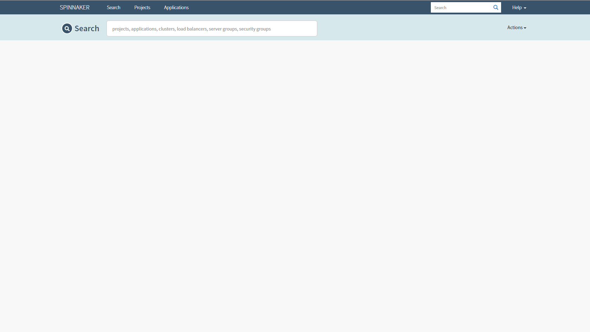

.. This work is licensed under a Creative Commons Attribution 4.0 International License.
.. http://creativecommons.org/licenses/by/4.0
.. SPDX-License-Identifier CC-BY-4.0
.. (c) Authors of Clover

.. _spinnaker_config_guide:

=========================================
Spinnaker Configuration Guide
=========================================

This document provides a guide to setup the spinnaker in kubernetes as a continuous delivery platform.

Spinnaker Overview
=====================

Spinnaker is an open-source, multi-cloud continuous delivery platform that helps you release software changes with high velocity and confidence.

Spinnaker provides two core sets of features:

**1. application management**

    You use Spinnaker’s application management features to view and manage your cloud resources.

**2. application deployment**

    You use Spinnaker’s application deployment features to construct and manage continuous delivery workflows.

For more information on Spinnaker and its capabilities, please refer to `documentation <https://www.spinnaker.io/>`_.

Setup Spinnaker
======================================

Prerequisites
-------------

The following assumptions must be met before continuing on to deployment:

 * Ubuntu 16.04 was used heavily for development and is advised for greenfield deployments.
 * Installation of Docker has already been performed. It's preferable to install Docker CE.
 * Installation of Kubernetes has already been performed.
 * A PersistentVolume resource need to be setup in k8s for the PersistentVolumeClaim to use. we supply the manifest file `minio-pv.yml <https://github.com/opnfv/clover/blob/master/clover/spinnaker/install/minio-pv.yml>`_ to create the PV, But it is not suitable for use in production.

Deploy from source
------------------

Clone the Clover git repository and navigate within the samples directory as shown below:

.. code-block:: bash

    $ git clone https://gerrit.opnfv.org/gerrit/clover
    $ cd clover/clover/spinnaker/install
    $ git checkout stable/gambia

To deploy the Spinnaker in the "spinnaker" Kubernetes namespace, use the following command:

.. code-block:: bash

    $ kubectl create -f quick-install-spinnaker.yml

Verifying the deployment
------------------------

To verify the Spinnaker pods is deployed, executing the command below:

.. code-block:: bash

    $ kubectl get pod -n spinnaker

The listing below must include the following Spinnaker pods:

.. code-block:: bash

    $ NAME                              READY     STATUS    RESTARTS   AGE
    minio-deployment-5d84f45dd5-zjdzb   1/1       Running   0          22h
    spin-clouddriver-795575c5cb-ph8qc   1/1       Running   0          22h
    spin-deck-7c5d75bfcd-vr58q          1/1       Running   0          22h
    spin-echo-7986796c94-4285v          1/1       Running   0          22h
    spin-front50-5744674fdc-d9xsw       1/1       Running   0          22h
    spin-gate-7978d55d57-jcsmq          1/1       Running   0          22h
    spin-halyard                        1/1       Running   0          22h
    spin-igor-6f8c86bbbb-cs8gd          1/1       Running   0          22h
    spin-orca-8659c57c5c-rs69z          1/1       Running   0          22h
    spin-redis-558db8d5bd-kdmjz         1/1       Running   0          22h
    spin-rosco-dfbbcbccd-db65b          1/1       Running   0          22h

To verify the Spinnaker services is created, executing the command below:

.. code-block:: bash

    $ kubectl get svc -n spinnaker

The listing below must include the following Spinnaker services:

.. code-block:: bash

    $ NAME             TYPE        CLUSTER-IP      EXTERNAL-IP   PORT(S)    AGE
    minio-service      ClusterIP   10.233.21.175   <none>        9000/TCP   22h
    spin-clouddriver   ClusterIP   10.233.9.27     <none>        7002/TCP   22h
    spin-deck          ClusterIP   10.233.34.86    <none>        9000/TCP   22h
    spin-echo          ClusterIP   10.233.29.150   <none>        8089/TCP   22h
    spin-front50       ClusterIP   10.233.5.221    <none>        8080/TCP   22h
    spin-gate          ClusterIP   10.233.33.196   <none>        8084/TCP   22h
    spin-halyard       ClusterIP   10.233.2.187    <none>        8064/TCP   22h
    spin-igor          ClusterIP   10.233.29.93    <none>        8088/TCP   22h
    spin-orca          ClusterIP   10.233.23.140   <none>        8083/TCP   22h
    spin-redis         ClusterIP   10.233.20.95    <none>        6379/TCP   22h
    spin-rosco         ClusterIP   10.233.48.79    <none>        8087/TCP   22h

To publish the spin-deck service, we need change the type to NodePort, executing the command below:

.. code-block:: bash

    $ kubectl get svc spin-deck -n spinnaker -o yaml |sed 's/ClusterIP/NodePort/' |kubectl replace -f -
    $ kubectl get svc -n spinnaker

The listing below must include the following services

.. code-block:: bash

    $ NAME             TYPE        CLUSTER-IP      EXTERNAL-IP   PORT(S)          AGE
    minio-service      ClusterIP   10.233.21.175   <none>        9000/TCP         22h
    spin-clouddriver   ClusterIP   10.233.9.27     <none>        7002/TCP         22h
    spin-deck          NodePort    10.233.34.86    <none>        9000:31747/TCP   22h
    spin-echo          ClusterIP   10.233.29.150   <none>        8089/TCP         22h
    spin-front50       ClusterIP   10.233.5.221    <none>        8080/TCP         22h
    spin-gate          ClusterIP   10.233.33.196   <none>        8084/TCP         22h
    spin-halyard       ClusterIP   10.233.2.187    <none>        8064/TCP         22h
    spin-igor          ClusterIP   10.233.29.93    <none>        8088/TCP         22h
    spin-orca          ClusterIP   10.233.23.140   <none>        8083/TCP         22h
    spin-redis         ClusterIP   10.233.20.95    <none>        6379/TCP         22h
    spin-rosco         ClusterIP   10.233.48.79    <none>        8087/TCP         22h

In your browser, navigate to the following URLs for Spinnaker respectively::

    http://<node IP>:31747

Where node IP is an IP from one of the Kubernetes cluster node(s).

Spinnaker Configuration
=======================

When the default installation is ready, there are many different components that you can turn on with Spinnaker. In order to customize Spinnaker, you can use the halyard command line or clover command line to edit the configuration and apply it to what has already been deployed.

Halyard Command
---------------

Halyard has an in-cluster daemon that stores your configuration. You can exec a shell in this pod to make and apply your changes.

For example:

.. code-block:: bash

    $ kubectl exec spin-halyard -n spinnaker -it -- bash -il
    spinnaker@spin-halyard:/workdir$ hal version list

How to use the halyard command line to configurate the spinnaker, please refer to `commands documentation <https://www.spinnaker.io/reference/halyard/commands/>`_.

Clover Command
--------------

Clover provider the cloverctl and clover-controller to controll the server. So we can use the cloverctl to configurate the spinnaker. So far, clover provide the capabilities to create/get/delete docker-registry and kubernetes provider in spinnaker.

**NOTE:** Before using clover command, you need build the clover command and setup the clover-controller in your local kubernetes cluster, where spinnaker deploy in.

Docker Registry
:::::::::::::::

You need a configuration file written in YAML that describe the information about you Docker Registry as shown below:

docker.yml::

  name: mydockerhub
  address: https://index.docker.io
  username: if-you-images-aren't-publicly-available
  password: fill-this-field
  repositories:
  - opnfv/clover

If any of your images aren’t publicly available, you need fill your DockerHub username & password. Ortherwise you can delete the username & password field.

Creating the Docker Registry in spinnaker:

.. code-block:: bash

    $ cloverctl create provider docker-registry -f docker.yml

Getting the Docker Registry in spinnaker:

.. code-block:: bash

    $ cloverctl get provider docker-registry

Deleting the Docker Registry in spinnaker:

.. code-block:: bash

    $ cloverctl delete provider docker-registry -n dockerhub

Kubernetes
::::::::::

By default, installing the manifest only registers the local cluster as a deploy target for Spinnaker. If you want to add arbitrary clusters you can use the cloverctl command

You need a running Kubernetes cluster, with corresponding credentials in a kubeconfig file(/path/to/kubeconfig). And You also need a configuration file written in YAML that describe the information about your kubernetes cluseter as shown below:

kubernetes.yml::

  # name must match pattern ^[a-z0-9]+([-a-z0-9]*[a-z0-9])?$'
  name: my-kubernetes
  providerVersion: V1
  # make sure the kubeconfigFile can be use
  kubeconfigFile: /path/to/kubeconfig
  dockerRegistries:
  - accountName: dockerhub

Creating the kubernetes provider in spinnaker:

.. code-block:: bash

    $ cloverctl create provider kubernetes -f kubernetes.yml

Getting the kubernetes provider in spinnaker:

.. code-block:: bash

    $ cloverctl get provider kubernetes

Deleting the kubernetes provider in spinnaker:

.. code-block:: bash

    $ cloverctl delete provider kubernetes -n my-kubernetes
