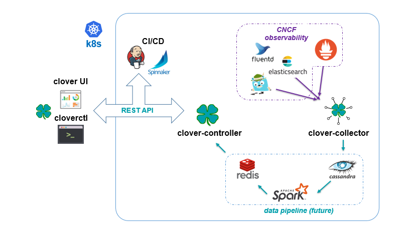
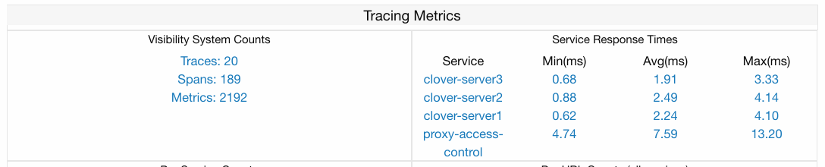
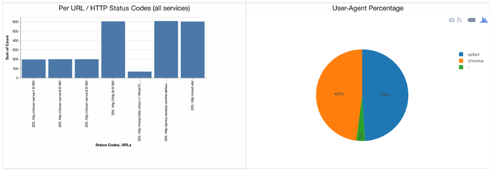
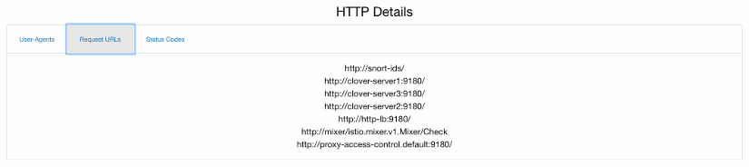
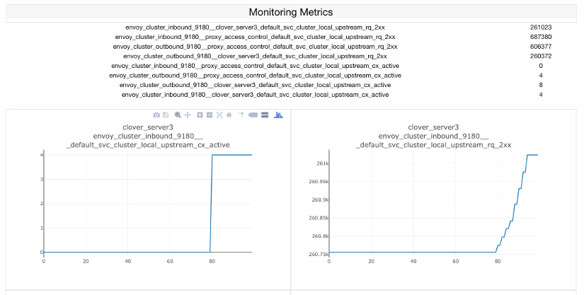

.. This work is licensed under a Creative Commons Attribution 4.0 International License.
.. http://creativecommons.org/licenses/by/4.0
.. SPDX-License-Identifier CC-BY-4.0
.. (c) Authors of Clover

.. _visibility_config_guide:

==============================================
Clover Visibility Services Configuration Guide
==============================================

This document provides a guide to use Clover visibility services, which are initially delivered in
the Clover Gambia release. A key assumption of this guide is that Istio 1.0.x has been deployed
to Kubernetes (k8s), as it is a foundational element for Clover visibility services.

Overview
=========

Clover visibility services are an integrated set of microservices that allow HTTP/gRPC traffic to
be observed and analyzed in an Istio service mesh within k8s managed clusters. It leverages
observability open source projects from the CNCF community such as Jaeger for distributed tracing
and Prometheus for monitoring. These tools are packaged with Istio and service mesh sidecars have
extensive hooks built in to interface with them. They gather low-level, per HTTP request driven
data. Clover visibility services focus on enriching the data, gathering it from various sources
and analyzing it at the system or aggregate level.

The visibility services are comprised of the following microservices all deployed within the
**clover-system** namespace in a k8s cluster:

 * **clover-controller** -  exposes REST interface external to the k8s cluster and
   used to relay messages to other Clover services via gRPC from external agents including
   **cloverctl** CLI, web browsers and other APIs, scripts or CI jobs. It incorporates a web
   application with dashboard views to consume analyzed visibility data and control other
   Clover services.

 * **clover-collector** - gathers data from tracing (Jaeger) and monitoring (Prometheus)
   infrastructure that is integrated with Istio using a pull model.

 * **clover-spark** - is a Clover specific Apache Spark service. It leverages Spark 2.3.x native
   k8s support and includes visibility services artifacts to execute Spark jobs.

 * **clover-spark-submit** - simple service to continually perform Spark job submits interacting
   with the k8s API to spawn driver and executor pods.

 * **cassandra** - a sink for visibility data from **clover-collector** with specific schemas
   for monitoring and tracing.

 * **redis** - holds configuration data and analyzed data for visibility services. Used by
   **clover-controller** web application and REST API to maintain state and exchange data.

The table below shows key details of the visibility service manifests outlined above:

+---------------------+----------------------+---------------------------+-----------------------+
| Service             | Kubernetes           | Docker Image              | Ports                 |
|                     | Deployment App Name  |                           |                       |
+=====================+======================+===========================+=======================+
| Controller          | clover-controller    | opnfv/clover-controller   | HTTP: 80 (external)   |
|                     |                      |                           | gRPC: 50052, 50054    |
|                     |                      |                           |                       |
+---------------------+----------------------+---------------------------+-----------------------+
| Collector           | clover-collector     | opnfv/clover-collector    | Jaeger: 16686         |
|                     |                      |                           | Prometheus: 9090      |
|                     |                      |                           | gRPC: 50054           |
|                     |                      |                           | Datastore: 6379, 9042 |
+---------------------+----------------------+---------------------------+-----------------------+
| Spark               | clover-spark         | opnfv/clover-spark        | Datastore: 6379, 9042 |
|                     | clover-spark-submit  | opnfv/clover-spark-submit |                       |
|                     |                      |                           |                       |
|                     |                      |                           |                       |
|                     |                      |                           |                       |
+---------------------+----------------------+---------------------------+-----------------------+
| Data Stores         | cassandra            | cassandra:3               | 9042                  |
|                     | redis                | k8s.gcr.io/redis:v1       | 6379                  |
|                     |                      | kubernetes/redis:v1       |                       |
+---------------------+----------------------+---------------------------+-----------------------+

The **redis** and **cassandra** data stores use community container images while the other
services use Clover-specific Dockerhub OPNFV images.

Additionally, visibility services are operated with the **cloverctl** CLI. Further information on
setting up **clover-controller** and **cloverctl** can be found at
:ref:`controller_services_config_guide`.

The diagram above shows the flow of data through the visibility services where all blue arrows
denote the path of data ingestion originating from the observability tools. The
**clover-collector** reads data from these underlying tools using their REST query interfaces
and inserts into schemas within the **cassandra** data store.

Apache Spark jobs are used to analyze data within **cassandra**. Spark is deployed using native
Kubernetes support added since Spark version 2.3. The **clover-spark-submit**
container continually submits jobs to the Kubernetes API. The API spawns a Spark driver pod which
in turn spawns executor pods to run Clover-specific jobs packaged in the **clover-spark**
service.

Analyzed data from **clover-spark** jobs is written to **redis**, an in-memory data store. The
**clover-controller** provides a REST API for the analyzed visibility data to be read by other
services (**cloverctl**, CI jobs, etc.) or viewed using a Clover provided visibility web
dashboard.

Deploying the visibility engine
===============================

.. _visibility_prerequisites:

Prerequisites
-------------

The following assumptions must be met before continuing on to deployment:

 * Installation of Docker has already been performed. It's preferable to install Docker CE.
 * Installation of k8s in a single-node or multi-node cluster with at least
   twelve cores and 16GB of memory. Google Kubernetes Engine (GKE) clusters are supported.
 * Installation of Istio in the k8s cluster. See :ref:`sdc_deploy_container`.
 * Clover CLI (**cloverctl**) has been downloaded and setup. Instructions to deploy can be found
   at :ref:`controller_services_controller`.

Deploy with Clover CLI
----------------------

To deploy the visibility services into your k8s cluster use the **cloverctl** CLI command
shown below::

    $ cloverctl create system visibility

Container images with the Gambia release tag will pulled if the tag is unspecified. The release
tag is **opnfv-7.0.0** for the Gambia release. To deploy the latest containers from master, use
the command shown below::

    $ cloverctl create system visibility -t latest

    Using config file: /home/earrage/.cloverctl.yaml
    Creating visibility services
    Created clover-system namespace
    Created statefulset "cassandra".
    Created service "cassandra"
    Created pod "redis".
    Created service "redis"
    Created deployment "clover-collector".
    Image: opnfv/clover-collector:latest
    Created service "clover-collector"
    Created deployment "clover-controller".
    Image: opnfv/clover-controller:latest
    Created service "clover-controller-internal"
    Created serviceaccount "clover-spark".
    Created clusterrolebinding "clover-spark-default".
    Created clusterrolebinding "clover-spark".
    Created deployment "clover-spark-submit".
    Image: opnfv/clover-spark-submit:latest

Verifying the deployment
------------------------

To verify the visibility services deployment, ensure the following pods have been deployed
with the command below::

    $ kubectl get pod --all-namespaces

    NAMESPACE      NAME                                    READY     STATUS
    clover-system   clover-collector-7dcc5d849f-6jc6m       1/1       Running
    clover-system   clover-controller-74d8596bb5-qrr6b      1/1       Running
    clover-system   cassandra-0                             1/1       Running
    clover-system   redis                                   2/2       Running
    clover-system   clover-spark-submit-6c4d5bcdf8-kc6l9    1/1       Running

Additionally, spark driver and executor pods will continuously be deployed as displayed below::

    clover-system   clover-spark-0fa43841362b3f27b35eaf6112965081-driver
    clover-system   clover-spark-fast-d5135cdbdd8330f6b46431d9a7eb3c20-driver
    clover-system   clover-spark-0fa43841362b3f27b35eaf6112965081-exec-3
    clover-system   clover-spark-0fa43841362b3f27b35eaf6112965081-exec-4

Initializing visibility services
================================

In order to setup visibility services, initialization and start commands must be
invoked from the **cloverctl** CLI. There are sample yaml files in yaml directory
from the **cloverctl** binary path. Navigate to this directory to execute the next
sequence of commands.

Initialize the visibility schemas in cassandra with the following command::

    $ cloverctl init visibility

    Using config file: /home/earrage/.cloverctl.yaml
    clover-controller address: http://10.145.71.21:32044
    Added visibility schemas in cassandra

The initial configuration to the visibility services are the Jaeger tracing and Prometheus
connection parameters and sample interval to **clover-collector**. To start visibility
use the sample yaml provided and execute the command::

    cloverctl start visibility -f start_visibility.yaml

    Started collector on pid: 44

The ``start_visibility.yaml`` has defaults for the tracing and monitoring modules packaged with
Istio 1.0.0.

Configure and control visibility
================================

The core requirement for Clover visibility services to function, is for your services to be
added to the Istio service mesh. Istio deployment and usage instructions are in the
:ref:`sdc_config_guide` and the Service Delivery Controller (SDC) sample can be used to
evaluate the Clover visibility services initially. A user may inject their own web-based services
into the service mesh and track separately.

Connecting to visibility dashboard UI
-------------------------------------

The **clover-controller** service comes packaged with a web-based UI with a visibility view.
To access the dashboard, navigate to the **clover-controller** address for either a ``NodePort``
or ``LoadBalancer`` service

    * http://<node or CNI IP address>:<``NodePort`` port>/
    * http://<``LoadBalancer`` IP address>/

See :ref:`exposing_clover_controller` to expose **clover-controller** externally with a k8s
service.

Set runtime parameters using Clover CLI
---------------------------------------

The services visibility will track are based on the deployment/pod names specified in the k8s
resources. Using some sample services from the SDC guide, the **proxy-access-control**,
**clover-server1**, **clover-server2** and **clover-server3** services are specified in the
``set_visibility.yaml`` sample yaml referenced below.

To modify the configuration of the services visibility will track, use the **cloverctl CLI**,
executing the following command::

    cloverctl set visibility -f set_visibility.yaml

Use the ``services:`` section of the yaml to configure service names to track.

.. code-block:: bash

    # set_visibility.yaml
    services:
        - name: proxy_access_control
        - name: clover_server1
        - name: clover_server2
        - name: clover_server3
    metric_prefixes:
        - prefix: envoy_cluster_outbound_9180__
        - prefix: envoy_cluster_inbound_9180__
    metric_suffixes:
        - suffix: _default_svc_cluster_local_upstream_rq_2xx
        - suffix: _default_svc_cluster_local_upstream_cx_active
    custom_metrics:
        - metric: envoy_tracing_zipkin_spans_sent

Set runtime parameters using dashboard UI
-----------------------------------------

The services being tracked by visibility can also be configured by selecting from the
boxes under **Discovered Services** within the dashboard, as shown in the graphic below.
Services can be multi-selected by using by holding the ``Ctrl`` or ``command`` (Mac OS)
keyboard button down while selecting or unselecting. The SDC services that were configured from
the **cloverctl** CLI above are currently active, denoted as the boxes with blue backgrounds.

.. image:: imgs/visibility_discovered_active.png
    :align: center
    :scale: 100%

In order for any services to be discovered from Jaeger tracing and displayed within the dashboard,
some traffic must target the services of interest. Using curl/wget to send HTTP requests
to your services will cause services to be discovered. Using Clover JMeter validation services,
as detailed :ref:`jmeter_config_guide` against SDC sample services will also generate a service
listing. The **cloverctl** CLI commands below will generate traces through the SDC service chain
with the JMeter master injected into the service mesh::

    $ cloverctl create testplan –f yaml/jmeter_testplan.yaml # yaml located with cloverctl binary
    $ cloverctl start testplan

Clearing visibility data
-------------------------

To clear visibility data in cassandra and redis, which truncates **cassandra** tables and
deletes or zeros out **redis** keys, use the following command::

    $ cloverctl clear visibility

This can be useful when analyzing or observing an issue during a particular time horizon.
The same function can be performed from the dashboard UI using the ``Clear`` button under
``Visibility Controls``, as illustrated in the graphic from the previous section.

Viewing visibility data
========================

The visibility dashboard can be used to view visibility data in real-time. The page will
automatically refresh every 5 seconds. To disable continuous page refresh and freeze on a
snapshot of the data, use the slider at the top of the page that defaults to ``On``. Toggling
it will result in it displaying ``Off``.

The visibility dashboard displays various metrics and graphs of analyzed data described in
subsequent sections.

System metrics
--------------

System metrics provide aggregate counts of cassandra tables including total traces, spans
and metrics, as depicted on the left side of the graphic below.

The metrics counter will continually increase, as it is based on time series data from
Prometheus. The trace count will correspond to the number of HTTP requests sent to services
within the Istio service mesh. The span count ties to trace count, as it is a child object
under Jaeger tracing data hierarchy and is based on the service graph (number of interactions
between microservices for a given request). It will increase more rapidly when service graph
depths are larger.

Per service response times
--------------------------

Per service response times are displayed on the right side of the graphic above and are
calculated from tracing data when visibility is started. The minimum, maximum and average
response times are output over the entire analysis period.

Group by span field counts
--------------------------

This category groups schema fields in various combinations to gain insight into the composition
of HTTP data and can be used by CI scripts to perform various validations. Metrics include:

  * Per service
  * Distinct URL
  * Distinct URL / HTTP status code
  * Distinct user-agent (HTTP header)
  * Per service / distinct URL

The dashboard displays bar/pie charts with counts and percentages, as depicted below. Each distinct
key is displayed when hovering your mouse over a chart value.

Distinct HTTP details
---------------------

A listing of distinct HTTP user-agents, request URLs and status codes is shown below divided
with tabs.

Monitoring Metrics
------------------

The Istio sidecars (Envoy) provide a lengthy set of metrics exposed through Prometheus. These
metrics can be analyzed with the visibility service by setting up metrics, as outlined in section
`Set runtime parameters using Clover CLI`_. Use ``metric_prefixes`` and ``metric_suffixes``
sections of the set visibility yaml for many Envoy metrics that have a key with the service
straddled by a prefix/suffix. A row in the table and a graph will be displayed for each
combination of service, prefix and suffix.

The metrics are displayed in tabular and scatter plots over time formats from the dashboard, as
shown in the graphic below:

Uninstall from Kubernetes envionment
====================================

Delete with Clover CLI
----------------------

When you're finished working with Clover visibility services, you can uninstall them with the
following command::

     $ cloverctl delete system visibility

The command above will remove the SDC sample services, Istio components and Jaeger/Prometheus
tools from your Kubernetes environment.

Uninstall from Docker environment
=================================

The OPNFV docker images can be removed with the following commands:

.. code-block:: bash

    $ docker rmi opnfv/clover-collector
    $ docker rmi opnfv/clover-spark
    $ docker rmi opnfv/clover-spark-submit
    $ docker rmi opnfv/clover-controller
    $ docker rmi k8s.gcr.io/redis
    $ docker rmi kubernetes/redis
    $ docker rmi cassandra:3
