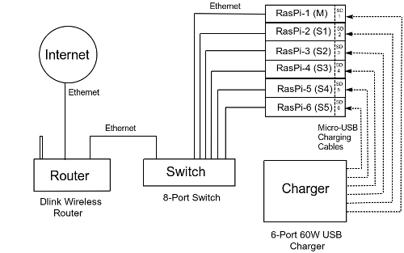

# Edge Cloud Native Cluster

This project revolves around the implementation of a kubernetes-based edge cluster supporting cloud-native framework on which exemplar micro-serives can be deployed with ease. The current implementation of this edge cluster uses six Raspberry Pi boards (one master - five slaves) and the goal is to demonstrate a live video streaming micro-service with end-to-end video streaming from this cluster to the Google Kubernetes Engine. The system would be integrated with Clover in the future. The key idea would be to inject Clover proxy to the existing live video streaming app and test the working of the service mesh functions as well as perform tests to check the continuous deployment (CD) trait as advertised in Clover.

Current Status: Raspberry Pi based kubernetes edge cluster has been built and tested.

## Setting up the Raspberry Pi cluster

These instructions will get you a copy of the cluster up and running on your local system for development and testing purposes. Note that the scripts have been tested on Raspberry Pi 3 model B but should work on other versions also.

### Prerequisites

- At least two Raspberry Pi 3 are required.
- Your computer and the RasPis should be on the same network. This can be achieved by connecting all the RasPis to the same router (via ethernet) with which your computer is connected (use a switch, if needed).

- Class-10 32GB microSD cards are preferred.
- Each RasPi should preferably be powered with the standard 5V, 2.5A supply.
- Ansible 2.2 or higher on the host computer.
- Internet access.

### Initial Steps

1. Download the official [Raspbian Stretch Lite](https://www.raspberrypi.org/downloads/raspbian/) OS and [flash](https://etcher.io) on all the microSD cards.
2. Enable ssh before OS installation for headless mode. This can be achieved by simply making an empty file by the name "ssh" (`$touch ssh`) in the boot partition of the flashed microSD card.
3. Preferably, change the hostname of all the RasPis to something like master-kube, slave1-kube, etc. for ease of distinguishability. To do this, simply edit "raspberrypi" in */etc/hostname* and */etc/hosts* files and reboot.
4. Enable passwordless-ssh access to each Raspberry Pi (needed for Ansible). Follow the instructions [here](https://www.raspberrypi.org/documentation/remote-access/ssh/passwordless.md).
5. All RasPis should have static IP addresses to ensure that the kubernetes cluster does not break. A simple way to do this is to make entries for each RasPi in the address revervation table (under DHCP) of your router.

### Ansible Playbook

The rest of the steps from checking dependencies and system configurations to docker and kubernetes installation to cluster formation are automated using ansible playbook.

1. Clone the project to your local machine which has ansible and is on the same network as the RasPis.
`git clone https://github.com/opnfv/clover.git`

2. Navigate to the sample directory present inside the edge directory.
`cd clover/edge/sample/`

3. Edit the *hosts* file. Remove all the IP addresses present in the file by default and simply add the IP address of your master RasPi under the *master* group and the addresses of your slave RasPis under the *slaves* group. 

4. Check if Ansible is able to reach all the RasPis by running the following ping command-
`$ansible kube-cluster -m ping`

5. Finally, run the *clusterForm* yaml playbook-
`$ansible-playbook clusterForm.yml`

Assuming no errors occurred in the previous step, you can now ssh into your master RasPi and check if the cluster is up and running-
```
kubectl get nodes
kubectl get pods --all-namespaces
```
To teardown the cluster, simply run the *clusterTear* yaml-
`$ansible-playbook clusterTear.yml`
Run *clusterForm* yaml to again build the cluster.
